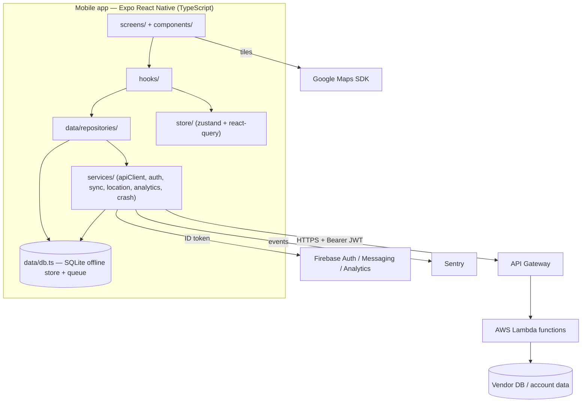

# Build Structure Clone & Dissection — Find Truck Service (iOS id1027671788 / Android org.fts.findtruckservice)

**Companion to:** `APP_BUILD_ANALYSIS.md` (market/listing analysis)
**Clone scaffold:** [`truck-service-clone/`](truck-service-clone/)
**Date:** August 15, 2026

This document reconstructs the **technical build structure** of the v7.0.6 build and dissects it
layer by layer. Because Apple ships no downloadable binary and the Android APK mirror is blocked
in this environment, the reconstruction is **evidence-based, not decompiled** — but the evidence
is unusually conclusive (a 73-library fingerprint plus cross-platform version lockstep). The
clone in `truck-service-clone/` is a **clean-room, unbranded** rebuild of that structure in the
same stack, so each architectural decision can be read as real code.

> Clean-room scope: the clone reproduces the *architecture* (stack, module boundaries, data flow,
> navigation graph) — not Find Truck Service's source, assets, branding, or data. Its identity is
> generic (`com.example.roadsidedirectory`). Nothing here is affiliated with the real company.

---

## 1. How the build was identified (method)

| Attempted | Result |
|---|---|
| Download iOS `.ipa` | Not possible — Apple does not expose binaries; encrypted App Store delivery. |
| Download Android `.apk` (apkpure/apkcombo) | **Blocked** — environment egress policy denies those hosts (403 at the proxy). |
| iTunes Lookup API + store page | Fetched (metadata only — see `APP_BUILD_ANALYSIS.md`). |
| **AppBrain "Technologies used" (Android)** | **Fetched — the decisive artifact:** full 73-library list + 16 permissions. |
| Company tech-stack enrichment (Exa) | `typescript, react native, react, aws lambda` — confirms the web/serverless side. |

So the structure below is reconstructed from the **library fingerprint of the shipping Android
package** plus the **iOS/Android version lockstep**, cross-checked against the app's advertised
features and privacy label. Confidence is called out per-claim in §9.

---

## 2. The decisive evidence

### 2a. Version lockstep ⇒ shared codebase
iOS was on **v1.3** (2015) and Android on **6.x**; in the March 2024 rewrite **both jumped to
7.0.2 within days**, and every 7.0.x release since has shipped on both stores in lockstep
(7.0.6: Android Jul 10, iOS Jul 20, 2026). Two independently-built native apps do not move in
lockstep like that. A shared cross-platform codebase does.

### 2b. The 73-library fingerprint (Android, via AppBrain)
Grouped by role — this *is* the build's skeleton:

| Layer | Libraries observed | Reads as |
|---|---|---|
| **Cross-platform runtime** | **React Native**, **Yoga**, Hermes (implied), **Expo**, Expo BlurView | Expo-managed React Native |
| **Navigation** | React Native Screens, React Native Safe Area Context, Gesture Handler | React Navigation |
| **Maps** | **Google Maps SDK**, **React Native Maps** | `react-native-maps` over Google Maps |
| **Backend / identity** | **React Native Firebase**, (Firebase core) | Firebase auth/messaging/analytics |
| **Crash / monitoring** | **Sentry** | Sentry crash + performance |
| **Networking / serial** | Okio, Google **gson**, Bolts, Brotli | OkHttp-based HTTP + JSON |
| **Local persistence** | **Jetpack DataStore**, **AndroidX SQLite**, React Native Async Storage | key-value + relational offline store |
| **Background work** | **Android WorkManager** | deferred/periodic sync jobs |
| **Animation / UI** | **Reanimated**, **Lottie**, React Native SVG, React Native WebView, DateTimePicker | RN UI stack |
| **Media** | **Glide**, **Android Image Cropper**, ExifInterface | vendor/profile photo pipeline |
| **DI / logging (native)** | **Koin**, Touchlab **Kermit** | Kotlin DI + logging in native modules |
| **Crypto** | Bouncy Castle | TLS / token crypto |

16 Android permissions (location fine/coarse, camera, internet, notifications, etc.) line up
with the feature set.

### 2c. Company/web signal
The reference company's own tech stack surfaces as **TypeScript, React, React Native, AWS
Lambda** (plus GitHub Actions). So: **React Native (TS) mobile + React (TS) web + AWS Lambda
serverless backend**, one product team, shared types.

### Verdict
> **Expo-managed React Native app, TypeScript, single shared codebase for iOS + Android**,
> talking to a **serverless (API Gateway → AWS Lambda) REST backend**, using **Firebase** for
> identity/push/analytics, **Sentry** for crash reporting, **Google Maps** via
> `react-native-maps`, and an **offline-first local store** (SQLite + DataStore + Async Storage)
> reconciled by **WorkManager**-scheduled background sync.

That verdict is the blueprint the clone is built from.

---

## 3. Size dissection — why 122 MB (Android) vs 76.8 MB (iOS)

Both numbers are consistent with an Expo RN app, and the gap is expected:

- The **122.1 MB** figure is the **universal APK** from a sideload mirror — it carries **all CPU
  ABIs** (arm64-v8a, armeabi-v7a, x86, x86_64), the full Hermes engine, and the native code for
  Reanimated, Lottie, Google Maps, SVG, and image processing, plus every density asset.
- The **76.8 MB** iOS number is Apple's **thinned, per-device** download (one architecture,
  App Thinning applied).
- On the Play Store the same Android **app bundle** delivers a per-device split far smaller than
  122 MB. The 54% jump from 49.8→76.8 MB at v7.0.6 reflects added native modules / assets in the
  rebuild, not a packaging change.

Nothing about the size implies native Swift/Kotlin; it is the normal footprint of an RN binary
with a heavy native-module set.

---

## 4. Reconstructed architecture

Layer dependency direction is strict: **screens → hooks → repositories → services → (network /
native / SQLite)**; components are presentational; models (Zod = types = validators) are imported
by every layer. See `truck-service-clone/docs/ARCHITECTURE.md`.

---

## 5. Layer-by-layer dissection (mapped to clone files)

### 5.1 Build manifest — `app.config.ts`
One Expo config generates both native shells. Encodes the observed build facts: **min iOS 16.4 /
min Android API 24**, Google Maps keys per platform, location + camera permission strings,
Firebase plugins, Sentry plugin, EAS OTA-update channel. This single file is *the* reason the two
stores ship in lockstep.

### 5.2 Dependency fingerprint — `package.json`
The exact library set from §2b, expressed as Expo/RN packages: `expo`, `react-native`,
`@react-navigation/*`, `react-native-maps`, `@react-native-firebase/{app,auth,messaging,analytics}`,
`@sentry/react-native`, `react-native-reanimated`, `lottie-react-native`, `expo-sqlite`,
`@react-native-async-storage/async-storage`, `@tanstack/react-query`, `zustand`, `zod`, `axios`.

### 5.3 Domain models — `src/models/*`
Zod schemas that are simultaneously the TypeScript types and the runtime validators. The model
set *is* the product's noun list: **Vendor** (with paid **ListingTier** + `authorizedVendor`),
**Category/ServiceType**, **Rating** (public), **Rate** (private price card), **RepairTicket**
(append-only update log — the "Start Repair" feature), **User/AccountType**, **Fleet/Truck**,
geo primitives with an `interstateMarker` field (mile-marker support, a real 7.0.3 feature).

### 5.4 Navigation — `src/navigation/*`
`RootNavigator` switches on auth status (native splash held during SecureStore session restore);
`AppTabs` = the five destinations **Search / Map / Saved / Repairs / Account**; nested stacks for
Search (Home→Results→VendorDetail) and Repairs (List→StartRepair→Ticket); Feedback is a global
modal (the 7.0.6 in-app feedback channel).

### 5.5 Services — `src/services/*`
- `apiClient.ts` — one axios instance; attaches the app JWT, **refresh-and-retry once on 401**,
  **Zod-validates every response** at the boundary.
- `auth.ts` — **Firebase authenticates → exchange ID token for a first-party app JWT**; session
  in SecureStore. (Explains the mandatory-registration complaints in reviews.)
- `sync.ts` — push `pendingSync` writes, pull `GET /me/sync?since=cursor`; the reconciler behind
  "shows up instantly."
- `location.ts`, `analytics.ts` (Firebase), `crashReporting.ts` (Sentry), `storage.ts`
  (SecureStore / AsyncStorage / SQLite split).

### 5.6 Data — `src/data/*`
`db.ts` is the **SQLite offline record store and outbound queue** (each record = JSON blob +
`pending` flag), the RN stand-in for the app's AndroidX SQLite + DataStore. Repositories
(`vendorRepository`, `repairRepository`) are the only things that touch both `apiClient` and
`db`, implementing the offline-first read/write and optimistic creates.

### 5.7 State — `src/store/*`
`react-query` owns **server state** (search, detail, categories, repairs); `zustand` owns
**client state** (`authStore`, `searchStore`). Clean separation is the core state decision.

### 5.8 Hooks / components / screens
Hooks (`useNearbyVendors` = infinite query keyed off live filters, `useRepairs`, `useLocation`,
`useAuth`) are the screens' only data access. Components are theme-only presentational units
(`VendorCard` renders the tier badge that encodes the monetization model; `MapMarker` colors pins
by service type; `RepairTicketCard` colors the status pill). Screens compose them.

---

## 6. Feature → screen → endpoint map

| User feature (from the listing) | Screen(s) | Endpoint(s) | Model |
|---|---|---|---|
| Search 30k+ vendors by category near me | SearchHome, Results | `GET /vendors/search`, `GET /categories` | Vendor, Category |
| Interactive map with pins | Map | `GET /vendors/search` | Vendor, Region |
| Vendor detail, call, directions, hours | VendorDetail | `GET /vendors/{id}` | Vendor |
| Driver ratings & reviews | VendorDetail | `GET\|POST /vendors/{id}/ratings` | Rating |
| Save favorites / private notes | Saved | `GET\|PUT /me/favorites` | Vendor |
| Add private locations (fleet-only) | Saved | `GET\|POST\|DELETE /me/locations` | Vendor(source=private) |
| Track vendor rates / repair costs | VendorDetail (RateTracker) | `GET\|PUT /me/rates` | Rate |
| "Start Repair" tickets, shared team | RepairsList, StartRepair, RepairTicket | `/me/repairs`, `/me/repairs/{id}/updates` | RepairTicket |
| Create account, backup & sync | SignIn, Register | `/auth/session`, `/me/sync` | User, Session |
| In-app feedback (new in 7.0.6) | Feedback | `POST /feedback` | — |

---

## 7. What the structure explains about the reviews

- **"Can't get in without giving personal info"** → auth-gated sync features (`auth.ts`): search
  is anonymous, but ratings/rates/private-locations/repairs need a Firebase account + app JWT.
- **"Map is cluttered / red dots" then fixed** → marker clustering + `MapMarker` render strategy;
  the 7.0.3/7.0.6 notes ("eliminated clusters", "fixed map flicker") are exactly this layer.
- **"Ratings/notes show up instantly"** → optimistic SQLite write + background `sync.ts`.
- **Mile markers / distance** → the `interstateMarker` + `distanceMiles` fields, server-computed.

---

## 8. Privacy/security posture (from structure + label)

The iOS label declares Location, Search History, Browsing History, Usage Data collected but
**not linked to identity**. Structurally that fits: **Firebase Analytics** (usage), **location**
sent with every `vendors/search`, and search/detail history. The **Sentry** SDK and **Firebase
Messaging** are consistent with the "Usage Data" and push. Note the cross-platform contradiction
flagged in the market analysis: Google Play's data-safety form claims "no data collected," which
cannot both be true given the shared codebase — the same SDKs run on both platforms.

---

## 9. Confidence — confirmed vs inferred

| Claim | Confidence | Basis |
|---|---|---|
| Expo React Native, shared TS codebase | **High** | 73-lib fingerprint (RN+Yoga+Expo) + version lockstep |
| Google Maps via react-native-maps | **High** | both libs present |
| Firebase auth/messaging/analytics | **High** | React Native Firebase present |
| Sentry crash reporting | **High** | Sentry present |
| SQLite + DataStore + Async Storage offline store | **High** | all three present |
| WorkManager background sync | **High** (mechanism) / Medium (exact policy) | WorkManager present; scheduling details inferred |
| AWS Lambda serverless backend | **Medium-High** | company tech-stack enrichment; exact API shape inferred |
| REST endpoint paths / payloads (`docs/api-contract.md`) | **Inferred** | reconstructed from features; not observed |
| Firebase-ID-token → app-JWT exchange | **Inferred** | common pattern; consistent with Firebase + own backend |
| react-query vs other server-cache lib | **Inferred** | not in the Android lib list (JS-only libs don't always show); representative choice |
| Screen graph / tab set | **Medium** | from listing features + screenshots; names are ours |

Everything in the clone's `src/` beyond the confirmed stack is a **faithful, labelled
reconstruction**, not a claim about Find Truck Service's actual source.

---

## 10. How to read the clone

Start at `truck-service-clone/app.config.ts` (the manifest), then `package.json` (the
fingerprint), then `src/App.tsx` (provider tree) → `src/navigation/RootNavigator.tsx` (the
auth/app switch) → `src/models/` (the domain) → `src/services/apiClient.ts` + `src/services/sync.ts`
(the network + offline spine). `docs/ARCHITECTURE.md` walks the data flow; `docs/api-contract.md`
is the backend contract the services target; `docs/build-structure.txt` is the annotated file tree.
